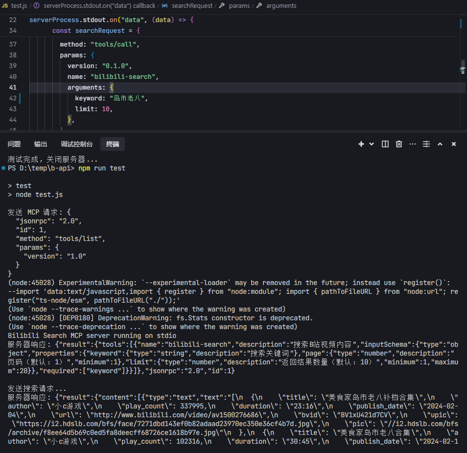
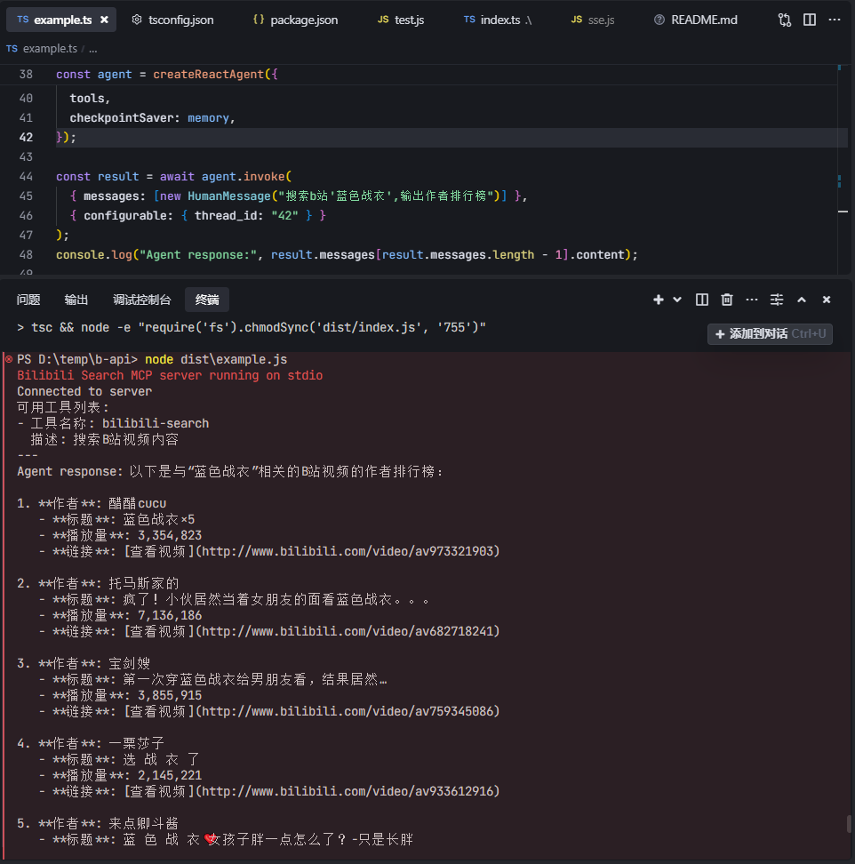

# Bilibili MCP

[](README-en.md)
[](README.md)
[](README-ja.md)

## Introduction
This is a Bilibili video search server based on the Model Context Protocol (MCP). The server provides a simple API interface that allows users to search for video content on Bilibili. It includes LangChain usage examples and test scripts.

## Acknowledgements
- LangChain example code referenced from [mcp-langchain-ts-client](https://github.com/isaacwasserman/mcp-langchain-ts-client)

## Features
- Bilibili video search
- Support for paginated queries
- Returns video information (title, author, view count, duration, etc.)
- Standardized interface based on the MCP protocol

## System Requirements
- Node.js >= 20.12.0

## npm package
Thanks to [HQHC](https://github.com/HQHC)for publishing the npm package
```json
{
  "mcpServers": {
    "bilibili-search": {
    "command": "npx",
    "args": ["bilibili-mcp"],
    "description": "Bilibili Video Search MCP service, enabling AI applications to search Bilibili video content."
    }
  }
}
```

## Quick Start
> If you want to run the LangChain example, please configure the LLM model first by modifying the .\example.ts file.
```javascript
const llm = new ChatOpenAI({
  modelName: "gpt-4o-mini",
  temperature: 0,
  openAIApiKey: "your_api_key", // Replace with your model's API key
  configuration: {
    baseURL: "https://www.api.com/v1", // Replace with your model's API address
  },
});

bun:

```bash
bun i
bun index.ts
# Test script
bun test.js
# MCP Inspector
bun run inspector
# Run LangChain example
bun build:bun
bun example.ts
```

npm:

```bash
npm i
npm run start
# Test script
npm run test
# MCP Inspector
npm run inspector
# Run LangChain example
npm run build
node dist/example.js
```

## SCREENSHOTS


